# 🎓 Apex Digital School — Next-Gen School Management & AI Education Operating System

[](https://react.dev/)
[](https://vitejs.dev/)
[](https://owasp.org/)
[](LICENSE)
[](#)

**Apex Digital School** is a full-featured, state-of-the-art **School ERP & AI-Powered Learning Management System (LMS)** designed to unify students, educators, parents, and administrative staff into a single, high-performance, real-time ecosystem.

Built with modern React and Vanilla CSS Glassmorphism aesthetics, it features role-based access control (RBAC), AI-driven diagnostic tutors, live virtual studios with collaborative whiteboards, automated gradebook marksheets with PDF export, dynamic attendance analytics, and comprehensive financial billing pipelines.

---

## 🌟 Key Highlights & Portal Ecosystem

```mermaid
graph TD
    A[Apex Digital School Operating System] --> B[Student Portal]
    A --> C[Teacher Portal]
    A --> D[Parent Portal]
    A --> E[Admin & Principal Control]
    A --> F[Finance & Operations]
    A --> G[AI Education Engine]

    B --> B1[Interactive Quizzes & Streak XP]
    B --> B2[LMS Videos & PDF Homework]
    B --> B3[Live Classroom Studio]
    B --> B4[Official Transcript PDF]

    C --> C1[Digital Attendance Roll Call]
    C --> C2[Course & Chapter Builder]
    C --> C3[Grading Workspace & Rubrics]
    C --> C4[Printable Marksheets PDF]

    D --> D1[Child 360° Profile]
    D --> D2[Fee Invoices & Online Card Pay]
    D --> D3[Transport Live GPS Tracking]

    G --> G1[AI Socratic Tutor]
    G --> G2[Automated Quiz Generator]
    G --> G3[AI PPTX Presentation Builder]
    G --> G4[Student At-Risk Predictive Analytics]
```



---

## 📱 Portals & Features Breakdown

### 👨‍🎓 1. Student Portal
- **Gamified Learning**: Level XP points, day streaks, badges & medals system (`Science Whiz`, `Quick Learner`, etc.).
- **Interactive Quizzes**: Real-time timer countdown, auto-submission, instant scoring, and an in-depth **Answer Review Mode** (explaining correct vs chosen answers).
- **LMS & Course Progress**: Chapter lectures, video streaming, downloadable worksheets, and PDF homework submission.
- **Academic Standing**: Cumulative GPA breakdown, class rank, subject mastery bars, and instant official **PDF Transcript Download**.
- **Live Classroom Studio**: Join virtual broadcasts, raise hand, use the collaborative whiteboard, and participate in moderated class chat.
- **Attendance & Fee Widget**: Real-time monthly attendance rate monitoring and fee billing status.

---

### 👨‍🏫 2. Teacher Portal
- **Daily Teaching Schedule**: Comprehensive daily class timetable with quick launch into Live Studio or offline classrooms.
- **Digital Attendance Roll Call**: One-click toggling (`Present`, `Absent`, `Late`) with automated SMS alert triggers and non-negative count protections.
- **Student 360° Profile Access**: Direct row-level inspection of any student's behavioral, academic, and attendance profile.
- **Assessment Evaluation Workspace**: Side-by-side submission review with score bounding, preset grading percentages, feedback editor, and multi-page document navigation.
- **Gradebook & Analytics**: Dynamic computation of class averages, top-performing classes, weakest curriculum topics, and **1-Click Official PDF Marksheet Export**.
- **Course & Chapter Manager**: Build video lectures, quizzes, and exercises with instant draft/published status toggling and confirmation safeguards.

---

### 👨‍👩‍👧 3. Parent Portal
- **Multi-Child Switcher**: Effortlessly switch between registered children with individualized metrics.
- **Student 360° Holistic View**: Attendance history, academic GPA, strengths, weak topics, and portfolio projects.
- **Fee Vouchers & Online Payments**: View month-by-month fee vouchers, download digital receipts, and pay online using simulated secure card checkout.
- **Live School Bus Tracking**: Real-time GPS bus simulation with ETA, driver contact, route stops, and emergency alerts.
- **Early Warning System**: Automated alerts when a child's attendance dips below 75% or when academic performance requires attention.

---

### 🛡️ 4. Super Admin, School Admin & Principal Suite
- **School-Wide Analytics**: Enrollment stats, fee collection revenue metrics, staff counts, and facility capacity.
- **Student Lifecycle & Registration**: Admin enrollment workflow that automatically generates student profiles, attendance records (100%), initial fee invoices, and linked parent login credentials.
- **Role-Based Access Control (RBAC)**: Strict permission enforcement across 10 specialized roles with unauthorized route barriers.
- **Staff Workload & HR**: Faculty leave management, departmental allocation, and workload distribution.
- **Digital Library**: Resource cataloging, book issuance, return tracking, and overdue fine computation.

---

### 🤖 5. AI Education Engine
- **AI Socratic Tutor**: Adaptive question-answering assistant tailored to the student's curriculum and grade level.
- **AI Quiz Generator**: Generates customized multiple-choice tests with answer keys based on any subject and difficulty.
- **AI Presentation Builder (PPTX)**: Generates structured classroom presentation outlines with 1-click downloadable PowerPoint (`.pptx`) slide decks.
- **Predictive Remedial Analytics**: Identifies weak topics across classes and recommends personalized revision exercises.

---

## 🔑 Super Administrator Credentials

| Role | Email | Password | Name | Designation |
|:-----|:------|:---------|:-----|:------------|
| 👑 **Super Admin** | `muhammad.okasha2146@gmail.com` | `greenpakistan2` | **Muhammad Okasha** | Director & System Owner |

> [!NOTE]
> All initial mock users have been cleaned out. The Super Administrator can enroll new students, teachers, parents, and staff members directly from the **Register Student / Staff** interface in the Admin Portal.

---

## 🛠️ Technology Stack & Architecture

- **Frontend Framework**: [React 18](https://react.dev/) + [Vite 5](https://vitejs.dev/)
- **Icons & UI Assets**: [Lucide React](https://lucide.dev/)
- **Styling Architecture**: Custom CSS Glassmorphism Design System with responsive variables, theme toggling, and HSL tokens.
- **Document Generation**:
  - **PDF Reports**: Custom high-fidelity HTML-to-Print PDF rendering engine (`src/utils/pdfPrinter.js`).
  - **PowerPoint Decks**: Custom client-side PPTX XML builder (`src/utils/pptxGenerator.js`).
- **Security & Integrity**:
  - `escapeHtml()` and `filterContent()` input sanitization against XSS.
  - Granular RBAC route guarding dictionary (`TAB_PERMISSIONS`).
  - PII redaction for minor students.
- **State & Resilience**: Safe `localStorage` synchronization with fallback memory store (`src/utils/storage.js`) and React `ErrorBoundary`.

---

## 🚀 Quick Start & Installation

### Prerequisites
- **Node.js**: v18.0.0 or higher
- **npm** or **yarn**

### 1. Clone Repository
```bash
git clone https://github.com/muhammadokashapak/Digital_School.git
cd Digital_School
```

### 2. Install Dependencies
```bash
npm install
```

### 3. Run Development Server
```bash
npm run dev
```
Open [http://localhost:5173](http://localhost:5173) in your browser.

### 4. Build for Production
```bash
npm run build
```
The optimized production bundle will be created in the `dist/` directory.

---

## 📂 Project Structure

```text
Digital_School/
├── public/                     # Public assets & SVG favicons
├── src/
│   ├── assets/                 # Images, logos, hero banners
│   ├── components/             # React UI Components
│   │   ├── TeacherPortal/      # Teacher-specific modules
│   │   │   ├── AssessmentManager.jsx    # Grading workspace & PDF evaluation
│   │   │   ├── CourseManager.jsx        # LMS course/chapter builder
│   │   │   ├── DashboardOverview.jsx    # Teacher home & daily timetable
│   │   │   ├── GradebookAnalytics.jsx   # Marksheets & grade analytics
│   │   │   └── MyClasses.jsx            # Attendance roll call table
│   │   ├── AccountantPortal.jsx         # Financial accounts & ledgers
│   │   ├── AdminPortal.jsx              # System administration & enrollment
│   │   ├── AiHub.jsx                    # AI Tutor, Quiz Gen & Lesson Planner
│   │   ├── CommunicationHub.jsx         # School notices, chat & announcements
│   │   ├── DigitalLibrary.jsx           # Library catalog & book loans
│   │   ├── ErrorBoundary.jsx            # React error boundary safety barrier
│   │   ├── ExamPortal.jsx               # Examination schedules & marks entry
│   │   ├── Header.jsx                   # Top navigation, role switch & theme
│   │   ├── HrPortal.jsx                 # Staff directory & leave management
│   │   ├── LiveClassroom.jsx            # Virtual studio & collaborative canvas
│   │   ├── LmsPortal.jsx                # Student learning courses & resources
│   │   ├── LoginScreen.jsx              # Authentication & quick demo cards
│   │   ├── NotificationModal.jsx        # Real-time alert center drawer
│   │   ├── ParentPortal.jsx             # Parent dashboard & bus GPS tracker
│   │   ├── PaymentModal.jsx             # Secure fee checkout modal
│   │   ├── PresentationViewerModal.jsx  # PPTX preview & download modal
│   │   ├── QuizModal.jsx                # Timed quiz taker & answer review
│   │   ├── ReportCardModal.jsx          # Official academic transcript modal
│   │   ├── Sidebar.jsx                  # Role-filtered navigation sidebar
│   │   ├── Student360Modal.jsx          # Holistic student profile popup
│   │   ├── StudentPortal.jsx            # Student dashboard & XP gamification
│   │   └── TransportPortal.jsx          # Fleet management & bus routes
│   ├── utils/
│   │   ├── pdfPrinter.js                # Sanitized printable PDF engine
│   │   ├── pptxGenerator.js             # PowerPoint presentation builder
│   │   ├── sanitize.js                  # XSS prevention & text moderation
│   │   └── storage.js                   # LocalStorage persistence utility
│   ├── App.jsx                          # Central state, RBAC & root layout
│   ├── index.css                        # Glassmorphism design tokens & styles
│   ├── main.jsx                         # Application entrypoint
│   └── mockData.js                      # Initial database seed dataset
├── package.json                         # Project dependencies & scripts
├── vite.config.js                       # Vite configuration
└── README.md                            # Project documentation
```

---

## 📜 License
This project is licensed under the **MIT License** — feel free to use and adapt it for educational institutions and management systems.

---
*Created with ❤️ by **Antigravity AI & Muhammad Okasha** — Empowering the future of digital education.*
