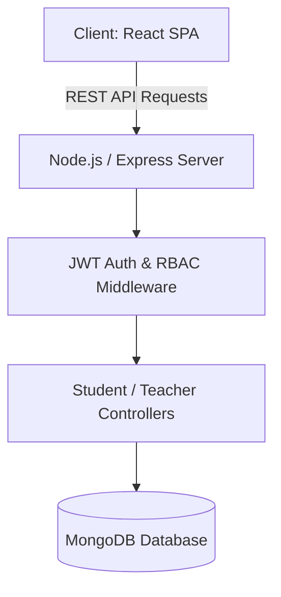

<div align="center">

# 🎓 Digital School Management Platform

<p align="center">
  <strong>Comprehensive Web-Based Educational Platform for Schools, Students & Teachers</strong>
</p>

<p align="center">
      
</p>

<p align="center">
  <a href="#-overview">Overview</a> •
  <a href="#-system-architecture">Architecture</a> •
  <a href="#-key-features--capabilities">Key Features</a> •
  <a href="#-tech-stack--tools">Tech Stack</a> •
  <a href="#-quick-start">Quick Start</a> •
  <a href="#-author--license">Author</a>
</p>

</div>

---

## 📌 Overview

A full-featured school management system enabling educational institutions to manage student admissions, track attendance, host online exams, grade assignments, and maintain teacher-parent communication.

---

## 🏗️ System Architecture



---

## ✨ Key Features & Capabilities

- 👨‍🎓 **Role-Based Portals**: Dedicated interfaces for Administrators, Teachers, and Students.
- 📝 **Online Exam & Gradebook**: Automated test scoring, report card generation, and transcript tracking.
- 📅 **Attendance & Schedules**: Class timetable manager with daily attendance analytics.
- 💬 **Instant Announcements**: Real-time school noticeboard and messaging system.

---

## 🛠️ Tech Stack & Tools

- **React.js**
- **Node.js**
- **Express.js**
- **MongoDB**
- **Tailwind CSS**
- **JWT**

---

## 🚀 Quick Start

### 📋 Prerequisites
Ensure you have the required runtime environment installed:
* **Git** version 2.30+
* **Python 3.9+** / **Node.js 18+** / **Android Studio** (depending on project stack)

### 📥 Installation & Setup

```bash
# 1. Clone the repository
git clone https://github.com/muhammadokashapak/Digital_School.git

# 2. Enter the directory
cd Digital_School
```

---

## 👨‍💻 Author & License

<div align="center">

**Muhammad Okasha**
<br/>
*Deep Learning & Mobile Software Engineer*
<br/><br/>
<a href="https://github.com/muhammadokashapak"></a>
<a href="https://linkedin.com/in/muhammad-okasha"></a>
<a href="mailto:muhammadokashapak@gmail.com"></a>

<br/><br/>

*⭐️ If you find this project helpful, please consider giving it a star! • © 2026 [Muhammad Okasha](https://github.com/muhammadokashapak)*

</div>
